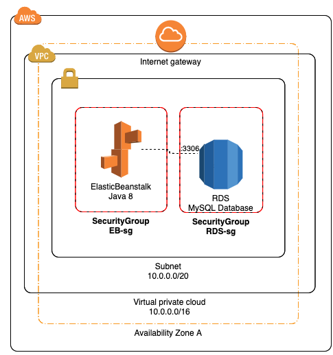

# Terraform AWS Archetype

With this starter terraform configuration you will deploy the following infrastructure:



To bootstrap this infrastructure: 
- First edit the `test.tfvars` file to customize the params.
- Edit `provider.tf` file to add your path to .aws/creds and the desired profile. 
 
After that you can simply execute the following command:

```bash
terraform apply -var-file="test.tfvars"
```

To destroy the generated aws resources: 

```bash
terraform destroy -var-file="test.tfvars"
```
